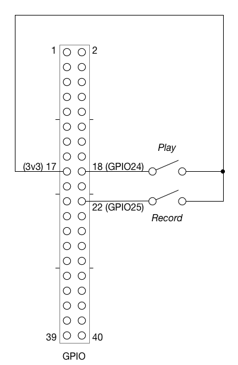

# your-call-python

Raspberry Pi-based audio snippet recording and playback system

## Solution Overview

This solution is designed as a "phone booth" installation, where visitors can record a short story through a telephone handset, and also play back previous recordings left by earlier visitors.

The user flow is as follows:

* User is presented with two buttons: a red button for recording, and a green button for playback and a telephone handset
* User can press the green button and a random recording is selected from the moderated recordings and played through the USB telephone handset
* User can then press the red button and record a new story. A prompt will be played (see [prompt.wav](prompt.wav)) providing basic instructions, then a beep signalling the start of recording, and finally when their time is complete, a different beep signifying the end of recording.

### Moderation of Recordings

There is a moderation process, currently via USB stick:

New recordings will be saved to the `recordings` folder on the USB stick.

Existing recordings for playback will be stored in the `moderated` folder on the USB stick.

The moderation process involves removal of the USB stick and manual listening to the stories in `recordings`, and dragging any approved recordings to the `moderated` folder.


## Software Setup

### Setting up the platform

Starting from a fresh Raspbian Stretch installation:

```
# install required packages
sudo apt-get update
sudo apt-get install git python3-pip alsa-tools
```

Then clone this repo, then set up python dependencies:

```
cd your-call-python
# install python dependencies
pip3 install -r pip_versions.txt
```

### Setting up auto-mount of USB drives

Copy the `11-usb-drive-auto-mount.rules` file into `/etc/udev/rules.d/`

Reload the udev rules:

```
sudo udevadm control --reload-rules
```

Then the USB drive should mount automatically at '/media/usb/'

[source: https://www.axllent.org/docs/view/auto-mounting-usb-storage/]

### Running this program

```
usage: main.py [-h] [-k] [-d D] [-f]

Record and play 1 minute audio

optional arguments:
  -h, --help  show this help message and exit
  -k          use keyboard instead of GPIO
  -d D        recording duration (seconds)
  -f          fake commands - print instead of running aplay/arecord
```

### Setting up this program to run as a service on startup

Copy/clone this whole `your-call-python` folder into `/usr/local/bin/`

Copy the `your-call.sh` file into `/etc/init.d`

Set up rc.d to run it at startup:

```
sudo update-rc.d your-call.sh defaults
```

[source: http://blog.scphillips.com/posts/2013/07/getting-a-python-script-to-run-in-the-background-as-a-service-on-boot/]

## Hardware Setup

The project uses two external push buttons for the play and record functions. These are on GPIO channels 24 and 25 respectively, and are pulled down to ground with the Pi's internal resistors, so no external resistor is required. The following circuit diagram shows the configuration:


